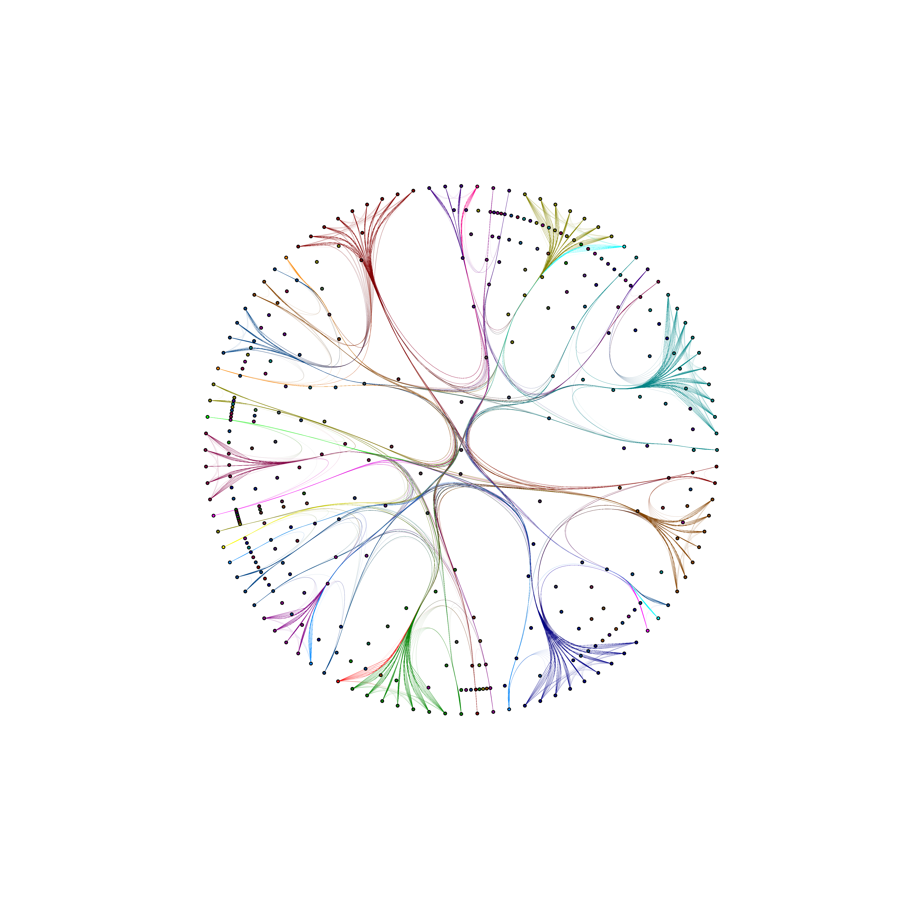

# radtree

[](https://github.com/poctaviano/radtree/actions/workflows/ci.yml)
[](./LICENSE)

`radtree` visualizes scikit-learn decision tree predictions as a radial graph. It is designed for quick exploratory inspection of class boundaries and prediction consistency on a sampled evaluation set.


## Installation

### Local editable install (recommended for development)

```bash
python -m venv .venv
source .venv/bin/activate
python -m pip install -U pip
python -m pip install -e .
```

### PyPI install (when published)

```bash
pip install radtree
```

If a PyPI release is not available yet, use editable install or GitHub source install.

## Quickstart (<30 seconds)

```python
from sklearn import datasets
from sklearn.model_selection import train_test_split
from sklearn.tree import DecisionTreeClassifier

import radtree

random_state = 42
X, y = datasets.load_iris(return_X_y=True)
X_train, X_test, y_train, y_test = train_test_split(
    X, y, test_size=0.4, random_state=random_state
)

clf = DecisionTreeClassifier(random_state=random_state)
clf.fit(X_train, y_train)

fig, ax = radtree.plot_radial(
    clf,
    X=X_test,
    Y=y_test,
    smooth_d=8,
    l_alpha=0.2,
    l_width=1,
    random_state=random_state,
)
```

## API

### `plot_radial`

```python
plot_radial(
    clf,
    X=None,
    Y=None,
    data=None,
    feature_cols=None,
    label_col=None,
    num_samples=100,
    levels=None,
    edges_labels=None,
    draw_labels=None,
    style="radplot",
    bbox="dark",
    cmap="pairs",
    tree_node_size=50,
    leaf_node_size=50,
    node_size=50,
    l_width=1,
    l_alpha=1,
    fig_res=72,
    save_img=False,
    img_res=300,
    png_transparent=True,
    spring=False,
    smooth_edges=False,
    smooth_d=None,
    smooth_res=50,
    random_state=None,
)
```

Core parameters:
- `clf`: fitted `DecisionTreeClassifier`.
- `X`/`Y` or `data`: input records and labels.
- `num_samples`: number of rows to render. Use `None` to use all rows.
- `random_state`: deterministic sampling seed.
- `smooth_d`: enables spline smoothing when set.
- `save_img`: saves output PNG to `./plots/`.

Return value:
- `(fig, ax)` matplotlib figure and axes.

Additional helpers:
- `quick_fitted_tree`
- `plot_pca`
- `plot_tsne`
- `plot_umap` (requires optional dependency `umap-learn`)

## Performance and limits

`plot_radial` can become expensive on larger datasets, especially with smoothing enabled.

Practical guidance:
- Start with `num_samples=50` or `100`.
- Increase to `200+` only when needed.
- Keep `smooth_d=None` for faster previews.
- Use `random_state` for repeatable comparisons.
- For full-dataset runs (`num_samples=None`), prefer smaller evaluation subsets if rendering gets slow.

## Examples

Notebooks and example datasets are available in [`notebooks/`](./notebooks/).




## Third-party notices

This repository includes third-party attribution details in [`THIRD_PARTY_NOTICES.md`](./THIRD_PARTY_NOTICES.md).

## Contributing

Please read [`CONTRIBUTING.md`](./CONTRIBUTING.md) for local setup, quality checks, and pull request expectations.

## License

Main project license: BSD 3-Clause ([`LICENSE`](./LICENSE)).
